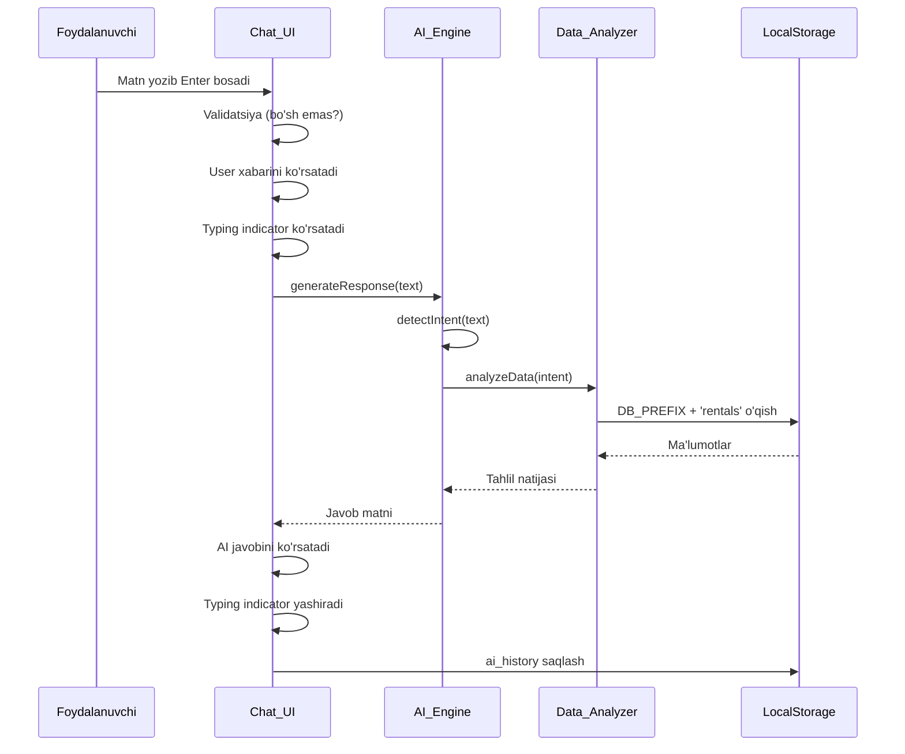

# Design Document: AI Yordamchi Chatbot

## Overview

Rentify ijaraboshqaruv tizimiga AI Yordamchi Chatbot qo'shiladi. Bu feature foydalanuvchiga o'z lokal ma'lumotlari (ijaralar, daromad, qarzdorlar, katalog) haqida o'zbek tilida tabiiy savol berish va tezkor javob olish imkonini beradi.

**Asosiy tamoyillar:**
- Backend yo'q — barcha mantiq brauzerda ishlaydi
- LocalStorage va IndexedDB dan ma'lumot o'qiladi
- Lokal mantiq asosiy rejim; OpenAI API ixtiyoriy qo'shimcha
- Vanilla JS (ES5 `'use strict'`), HTML, CSS — hech qanday framework yo'q
- Mavjud global o'zgaruvchilar va funksiyalar bilan to'liq integratsiya

---

## Architecture

Chatbot uch qatlamli arxitekturaga asoslanadi:

```
┌─────────────────────────────────────────────────────┐
│                    Chat_UI Layer                     │
│  (ai-chat.js + index.html + style.css)               │
│  - Floating panel / Mobile fullscreen                │
│  - Message bubbles, typing indicator                 │
│  - Quick actions, clear button                       │
└──────────────────────┬──────────────────────────────┘
                       │ sendMessage(text)
                       ▼
┌─────────────────────────────────────────────────────┐
│                   AI_Engine Layer                    │
│  (ai-chat.js — AiEngine namespace)                   │
│  - Intent detection (keyword matching)               │
│  - Response formatting (Uzbek)                       │
│  - Optional: OpenAI API call                         │
└──────────────────────┬──────────────────────────────┘
                       │ analyzeData(intent)
                       ▼
┌─────────────────────────────────────────────────────┐
│                 Data_Analyzer Layer                  │
│  (ai-chat.js — DataAnalyzer namespace)               │
│  - LocalStorage read (DB_PREFIX)                     │
│  - Income, debtors, active rentals, catalog          │
│  - User isolation via DB_PREFIX                      │
└─────────────────────────────────────────────────────┘
```

**Fayl tuzilmasi:**
- `ai-chat.js` — barcha chatbot logikasi (yangi fayl)
- `index.html` — chatbot HTML markup qo'shiladi (`</body>` oldidan)
- `style.css` — chatbot CSS qo'shiladi

**Integratsiya nuqtasi:** `initApp()` funksiyasi chaqirilgandan keyin `initAiChat()` chaqiriladi.

---

## Components and Interfaces

### 1. Chat_UI Komponenti

**HTML tuzilmasi:**
```
#ai-chat-btn          — Floating trigger tugmasi (pastki o'ng)
#ai-chat-panel        — Asosiy suhbat paneli
  #ai-chat-header     — Sarlavha + yopish tugmasi + tozalash tugmasi
  #ai-chat-messages   — Xabarlar ro'yxati (scroll)
  #ai-chat-quick      — Quick action tugmalari (bo'sh suhbatda)
  #ai-chat-input-row  — Matn kiritish + yuborish tugmasi
```

**Holat boshqaruvi (JS obyekti):**
```javascript
var AiChatState = {
  isOpen: false,
  isLoading: false,
  messages: [],          // { role: 'user'|'ai', text: '', ts: Date }
  apiEnabled: false,
  apiKey: ''
};
```

**Asosiy funksiyalar:**
```javascript
function initAiChat()           // App init da chaqiriladi
function openAiChat()           // Panel ochish
function closeAiChat()          // Panel yopish
function sendAiMessage(text)    // Xabar yuborish
function renderAiMessages()     // Xabarlarni DOM ga chizish
function clearAiChat()          // Tarixni tozalash
function loadAiHistory()        // LocalStorage dan yuklash
function saveAiHistory()        // LocalStorage ga saqlash
```

### 2. AI_Engine Komponenti

**Intent turlari (enum):**
```javascript
var AI_INTENTS = {
  INCOME:      'income',      // daromad, pul, tushum, foydа
  DEBTORS:     'debtors',     // qarzdor, to'lanmagan, nasiya
  ACTIVE:      'active',      // faol, aktiv, hozir
  CATALOG:     'catalog',     // katalog, mahsulot, asbob, narx
  CLIENT:      'client',      // mijoz, klient, odam
  STATS:       'stats',       // statistika, hisobot, tahlil
  GREETING:    'greeting',    // salom, assalomu, xayr
  UNKNOWN:     'unknown'
};
```

**Kalit so'zlar xaritasi (o'zbek sinonimlar bilan):**
```javascript
var INTENT_KEYWORDS = {
  income:  ['daromad','pul','tushum','foyda','qancha','ishlad','topd'],
  debtors: ['qarzdor','to\'lanmagan','nasiya','qarz','kim bermas','unpaid'],
  active:  ['faol','aktiv','hozir','ijarada','berilgan','chiqarilgan'],
  catalog: ['katalog','mahsulot','asbob','narx','nechta','bor','mavjud'],
  client:  ['mijoz','klient','odam','kim','shaxs'],
  stats:   ['statistika','hisobot','tahlil','eng ko\'p','top','reyting'],
  greeting:['salom','assalomu','xayr','rahmat','hello','hi']
};
```

**Asosiy funksiyalar:**
```javascript
function detectIntent(text)           // Intent aniqlash
function generateResponse(intent, text) // Javob shakllantirish
function callOpenAI(text, context)    // API rejim (ixtiyoriy)
```

### 3. Data_Analyzer Komponenti

**Asosiy funksiyalar:**
```javascript
function analyzeIncome(period)        // 'today'|'week'|'month'
function analyzeDebtors()             // unpaid ijaralar
function analyzeActiveRentals()       // active|partial ijaralar
function analyzeTopItems()            // eng ko'p ijaralangan
function analyzeClient(name)          // mijoz tarixi
function analyzeCatalog()             // mahsulotlar ro'yxati
function safeReadLS(key, fallback)    // xavfsiz LocalStorage o'qish
```

---

## Data Models

### Message obyekti
```javascript
{
  id:   String,   // Date.now() + Math.random()
  role: String,   // 'user' | 'ai'
  text: String,   // xabar matni
  ts:   Number    // timestamp (ms)
}
```

### AiSettings obyekti (LocalStorage)
```javascript
// Kalit: DB_PREFIX + 'ai_settings'
{
  apiEnabled:       Boolean,  // API rejim yoqilganmi
  apiKey:           String,   // OpenAI API kaliti (foydalanuvchi kiritadi)
  privacyConsented: Boolean   // Shaxsiy ma'lumot yuborish ruxsati
}
```

### Chat tarixi (LocalStorage)
```javascript
// Kalit: DB_PREFIX + 'ai_history'
// Qiymat: Message[] (maksimal 100 ta)
[
  { id: '...', role: 'user', text: '...', ts: 1234567890 },
  { id: '...', role: 'ai',   text: '...', ts: 1234567891 }
]
```

### Mavjud ma'lumot modellari (o'qish uchun)
```javascript
// DB_PREFIX + 'rentals' — Rental[]
{
  id, clientName, phone, startDate, returnDate,
  status: 'active'|'partial'|'returned',
  payment: 'paid'|'unpaid',
  items: [{ itemId, qty }],
  totalPrice
}

// DB_PREFIX + 'items' — Item[]
{ id, name, dayRate, qty, ... }

// DB_PREFIX + 'tools' — Tool[] (tools kategoriyasi uchun)
{ id, name, dayRate, qty }
```

---

## Mermaid Diagram: Xabar yuborish oqimi



---

## Correctness Properties

*A property is a characteristic or behavior that should hold true across all valid executions of a system — essentially, a formal statement about what the system should do. Properties serve as the bridge between human-readable specifications and machine-verifiable correctness guarantees.*

### Property 1: Xabar yuborish — non-empty validatsiya

*For any* matn kiritish, agar matn faqat whitespace belgilaridan iborat bo'lsa (bo'sh string, bo'shliqlar, tab, newline), AI_Engine chaqirilmasligi va xabarlar ro'yxati o'zgarmasligi kerak.

**Validates: Requirements 2.5**

---

### Property 2: Xabar ko'rsatish tomoni

*For any* xabar obyekti, agar `role === 'user'` bo'lsa u o'ng tomonda, `role === 'ai'` bo'lsa u chap tomonda render qilinishi kerak.

**Validates: Requirements 2.3**

---

### Property 3: Suhbat tarixi persistence (round-trip)

*For any* xabar to'plami, xabarlar LocalStorage ga saqlanib, qayta o'qilganda asl to'plam bilan teng bo'lishi kerak (id, role, text, ts maydonlari saqlanadi).

**Validates: Requirements 2.6, 7.3**

---

### Property 4: Xabarlar soni chegarasi

*For any* suhbat tarixi, 100 ta xabardan ortiq qo'shilganda eng eski xabarlar o'chirilib, umumiy soni hech qachon 100 dan oshmasligi kerak.

**Validates: Requirements 7.4**

---

### Property 5: Daromad hisoblash to'g'riligi

*For any* ijara to'plami, Data_Analyzer tomonidan hisoblangan daromad qiymati ijaralar `totalPrice` yig'indisiga teng bo'lishi kerak (berilgan davr uchun).

**Validates: Requirements 3.1**

---

### Property 6: Qarzdorlar filtrlash

*For any* ijara to'plami, `analyzeDebtors()` natijasida faqat `payment === 'unpaid'` bo'lgan ijaralar qaytarilishi kerak — boshqa to'lov holatidagi ijaralar natijaga kirmasligi kerak.

**Validates: Requirements 3.2**

---

### Property 7: Faol ijaralar filtrlash

*For any* ijara to'plami, `analyzeActiveRentals()` natijasida faqat `status === 'active'` yoki `status === 'partial'` bo'lgan ijaralar qaytarilishi kerak.

**Validates: Requirements 3.4**

---

### Property 8: Foydalanuvchi ma'lumot izolyatsiyasi

*For any* Data_Analyzer so'rovi, qaytarilgan barcha ma'lumotlar faqat joriy `DB_PREFIX` ostidagi LocalStorage kalitlaridan o'qilishi kerak — boshqa foydalanuvchilarning `DB_PREFIX` lari bilan boshlanadigan kalitlarga murojaat bo'lmasligi kerak.

**Validates: Requirements 3.6**

---

### Property 9: Intent aniqlash — katta-kichik harf mustaqilligi

*For any* kalit so'z, uning katta harf (`DAROMAD`), kichik harf (`daromad`) va aralash (`Daromad`) variantlari bir xil intent qaytarishi kerak.

**Validates: Requirements 4.4**

---

### Property 10: Sinonim intent aniqlash

*For any* intent uchun belgilangan sinonimlar to'plami, to'plamdagi har bir so'z bir xil intent qaytarishi kerak.

**Validates: Requirements 4.5**

---

### Property 11: Tanilmagan savol — fallback javob

*For any* savol matni, agar u hech qanday intent kalit so'ziga mos kelmasa, AI_Engine bo'sh string emas, balki yordam xabari qaytarishi kerak.

**Validates: Requirements 4.3**

---

### Property 12: API xatosi — lokal rejimga o'tish

*For any* API xatosi (network error, 4xx, 5xx), AI_Engine avtomatik ravishda lokal mantiq rejimine o'tib, lokal javob qaytarishi kerak (null yoki exception emas).

**Validates: Requirements 5.3**

---

### Property 13: Quick action — xabarlar mavjudligida yashirish

*For any* non-empty xabarlar ro'yxati, quick action tugmalari DOM da yashirilgan (display:none yoki hidden class) bo'lishi kerak.

**Validates: Requirements 6.3**

---

### Property 14: Tozalash — bo'sh holat invarianti

*For any* suhbat tarixi (bo'sh bo'lmagan), `clearAiChat()` chaqirilgandan keyin xabarlar ro'yxati bo'sh bo'lishi, LocalStorage dagi tarix o'chirilishi va quick action tugmalari ko'rinishi kerak.

**Validates: Requirements 7.2**

---

### Property 15: AI xatosi — foydalanuvchiga xabar

*For any* AI_Engine ichida yuz bergan exception, foydalanuvchiga o'zbek tilida xato xabari ko'rsatilishi kerak (exception brauzer konsoliga chiqib ketmasligi kerak).

**Validates: Requirements 8.2**

---

### Property 16: Login bo'lmagan holda chatbot ko'rinmasligi

*For any* holat, `currentUser === null` bo'lganda chatbot trigger tugmasi va paneli DOM da ko'rinmasligi (display:none) kerak.

**Validates: Requirements 8.4**

---

## Error Handling

### LocalStorage xatolari
```javascript
function safeReadLS(key, fallback) {
  try {
    var raw = localStorage.getItem(key);
    return raw ? JSON.parse(raw) : fallback;
  } catch (e) {
    console.warn('[AI Chat] LocalStorage xato:', key, e);
    return fallback; // null o'rniga fallback qaytarish
  }
}
```

### AI_Engine xatolari
- Har qanday exception `try/catch` bilan ushlanadi
- Foydalanuvchiga o'zbek tilida xabar: `"Kechirasiz, javob tayyorlashda xato yuz berdi. Qayta urinib ko'ring."`
- Console ga `console.warn` bilan log qilinadi

### API xatolari
- Network timeout: 10 soniya kutiladi, keyin lokal rejimga o'tish
- 4xx/5xx: Lokal rejimga o'tish + foydalanuvchiga ogohlantirishni ko'rsatish
- API kaliti noto'g'ri (401): Foydalanuvchiga API kalitini tekshirish so'raladi

### Autentifikatsiya
- `initAiChat()` da `currentUser` tekshiriladi
- Null bo'lsa: chatbot elementi yashiriladi, `showLogin()` chaqiriladi

---

## Testing Strategy

### Dual Testing Approach

Bu feature uchun ham unit testlar, ham property-based testlar qo'llaniladi:

**Unit testlar** (aniq misollar):
- Intent aniqlash: har bir intent uchun 2-3 namunaviy savol
- Quick action tugmalari: 4 ta tugma mavjudligi
- API rejim: ruxsat dialog ko'rsatilishi
- Login yo'q holat: chatbot yashirilishi

**Property-based testlar** (universal xususiyatlar):
- Kutubxona: **fast-check** (JavaScript uchun eng keng tarqalgan PBT kutubxonasi)
- Har bir property test kamida **100 iteratsiya** bilan ishga tushiriladi
- Har bir test tegishli design property ga havola qiladi

### Property Test Konfiguratsiyasi

```javascript
// fast-check bilan misol
// Feature: ai-assistant-chatbot, Property 1: Whitespace validatsiya
fc.assert(
  fc.property(
    fc.stringOf(fc.constantFrom(' ', '\t', '\n', '\r')),
    function(whitespaceText) {
      var before = AiChatState.messages.length;
      sendAiMessage(whitespaceText);
      return AiChatState.messages.length === before;
    }
  ),
  { numRuns: 100 }
);
```

**Tag formati:** `// Feature: ai-assistant-chatbot, Property N: <property_text>`

### Test fayllari
- `tests/ai-chat.unit.test.js` — unit testlar (Jest yoki qo'lda)
- `tests/ai-chat.property.test.js` — property testlar (fast-check)

### Integration testlar
- API integratsiyasi: mock fetch bilan 2-3 misol
- LocalStorage persistence: real localStorage bilan round-trip

### Qamrov maqsadlari
- Data_Analyzer funksiyalari: 90%+
- AI_Engine intent aniqlash: 95%+
- Chat_UI holat boshqaruvi: 80%+
