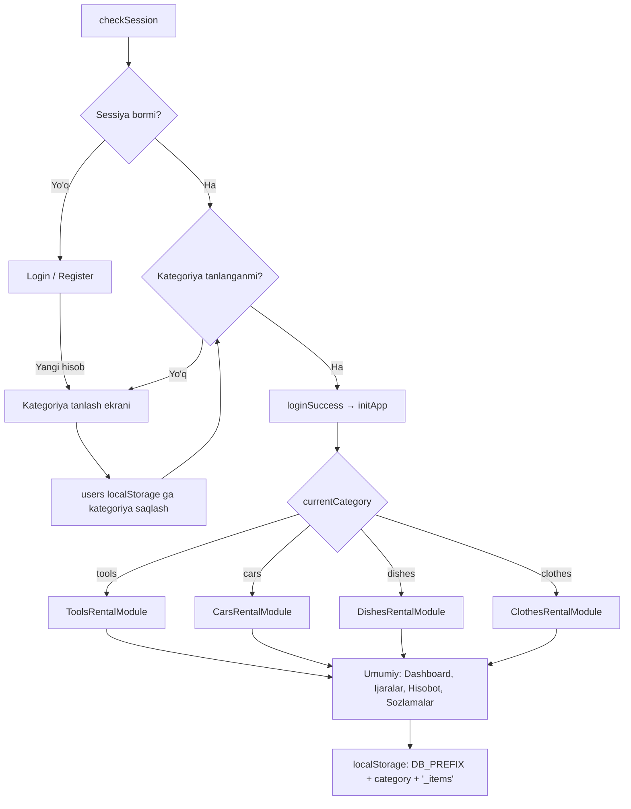
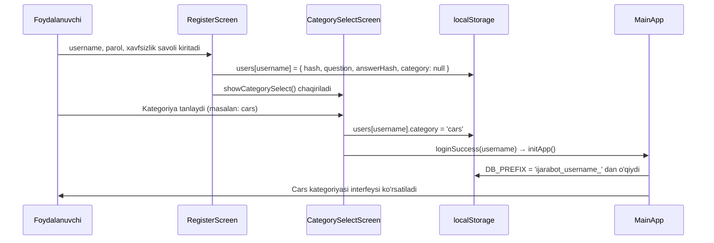
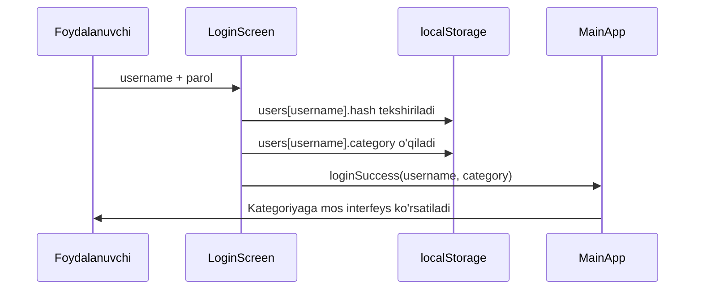
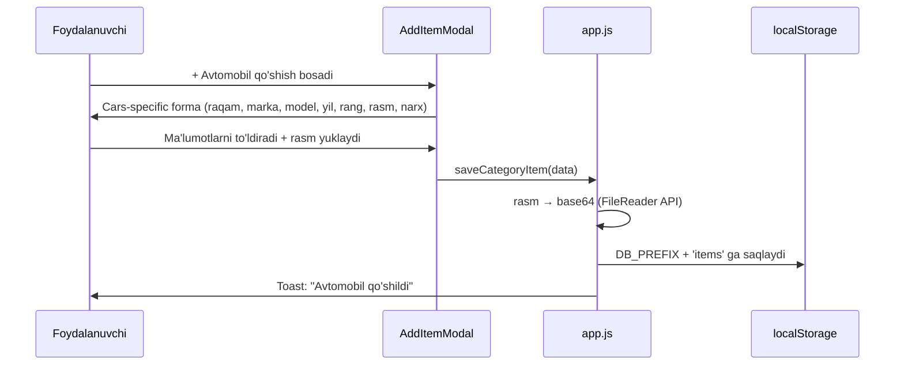

# Design Document: Multi-Category Rental

## Overview

BuildZone ijarasi boshqaruv tizimini kengaytirish — bir platformada bir nechta ijara kategoriyalarini (qurilish asboblari, avtomobil, idish-tovoqlar, kiyimlar) qo'llab-quvvatlash. Har bir foydalanuvchi ro'yxatdan o'tishda o'z kategoriyasini bir marta tanlaydi va keyingi kirish­larda to'g'ridan-to'g'ri o'sha kategoriyaga xos interfeys va ma'lumot modeli bilan ishlaydi.

Mavjud auth tizimi, localStorage arxitekturasi va PWA infratuzilmasi o'zgarishsiz saqlanadi; faqat foydalanuvchi profili kengaytiriladi va har bir kategoriya uchun alohida UI komponentlar, ma'lumot modellari va CRUD operatsiyalari qo'shiladi.

---

## Architecture



---

## Sequence Diagrams

### Yangi foydalanuvchi ro'yxatdan o'tishi



### Mavjud foydalanuvchi kirishi



### Ijara elementi qo'shish (Cars misoli)



---

## Components and Interfaces

### CategorySelectScreen

**Maqsad**: Yangi foydalanuvchi ro'yxatdan o'tgandan so'ng bir marta ko'rsatiladigan ekran.

**Interface**:
```javascript
// HTML element: #category-select-screen
// Funksiyalar:
function showCategorySelect()
function selectCategory(categoryKey)  // 'tools' | 'cars' | 'dishes' | 'clothes'
function saveCategoryAndProceed(username, categoryKey)
```

**Mas'uliyatlar**:
- 4 ta kategoriya kartasini ko'rsatish (ikonka, nom, tavsif)
- Tanlangan kategoriyani `users[username].category` ga saqlash
- `loginSuccess()` ni chaqirish

---

### CategoryRouter

**Maqsad**: `currentCategory` qiymatiga qarab to'g'ri UI komponentlarni yuklash.

**Interface**:
```javascript
var currentCategory = null;  // 'tools' | 'cars' | 'dishes' | 'clothes'

function initApp()           // mavjud — kengaytiriladi
function renderCatalogPage() // currentCategory ga qarab to'g'ri render chaqiradi
function renderAddModal()    // kategoriyaga mos modal ochadi
```

---

### ItemModule (har bir kategoriya uchun)

Har bir kategoriya quyidagi standart interfeysni amalga oshiradi:

```javascript
// Katalog sahifasi
function renderItems()          // grid/list ko'rinishida elementlarni chiqaradi
function openItemModal(id)      // qo'shish/tahrirlash modali
function saveItem()             // validatsiya + localStorage saqlash
function deleteItem(id)         // o'chirish (ijarada bo'lmasa)

// Ijara jarayoni
function buildItemPicker(selectedItems)   // ijara modalida element tanlash
function getItemInUseQty(itemId, excludeRentalId)
function calcRentalPrice(items, hours)    // kategoriyaga mos hisoblash
```

---

### ToolsModule (mavjud, o'zgarishsiz)

Mavjud `tools` massivi va barcha funksiyalar saqlanadi. Faqat `currentCategory === 'tools'` bo'lganda faollashadi.

---

### CarsModule

**Ma'lumot modeli**:
```javascript
{
  id: Number,           // Date.now()
  plateNumber: String,  // "01 A 123 BC" — davlat raqami
  brand: String,        // "Chevrolet"
  model: String,        // "Malibu"
  year: Number,         // 2020
  color: String,        // "Oq"
  imageBase64: String,  // "data:image/jpeg;base64,..." yoki null
  dayRate: Number,      // kunlik narx (so'm)
  qty: 1                // avtomobil uchun har doim 1
}
```

**Ijara elementi**:
```javascript
{ itemId: Number, qty: 1 }
```

---

### DishesModule

**Ma'lumot modeli**:
```javascript
{
  id: Number,
  name: String,         // "Katta lagan"
  type: String,         // "Lagan" | "Piyola" | "Qozon" | "Boshqa"
  qty: Number,          // umumiy miqdor
  dayRate: Number       // kunlik narx (so'm)
}
```

---

### ClothesModule

**Ma'lumot modeli**:
```javascript
{
  id: Number,
  name: String,         // "To'y ko'ylagi"
  size: String,         // "S" | "M" | "L" | "XL" | "XXL" | "Boshqa"
  type: String,         // "Ko'ylak" | "Shim" | "Kostyum" | "Boshqa"
  qty: Number,
  dayRate: Number
}
```

---

## Data Models

### localStorage Kalit Strukturasi

```
ijarabot_users                          → { [username]: UserRecord }
ijarabot_{username}_rentals             → RentalRecord[]   (mavjud)
ijarabot_{username}_tools               → ToolRecord[]     (mavjud, tools uchun)
ijarabot_{username}_items               → CategoryItemRecord[]  (cars/dishes/clothes uchun)
ijarabot_{username}_workers             → string[]         (mavjud)
ijarabot_session                        → username string  (mavjud)
```

### UserRecord (kengaytirilgan)

```javascript
{
  hash: String,           // parol hashi (mavjud)
  question: String,       // xavfsizlik savoli (mavjud)
  answerHash: String,     // javob hashi (mavjud)
  createdAt: String,      // ISO date (mavjud)
  category: String        // YANGI: 'tools' | 'cars' | 'dishes' | 'clothes' | null
}
```

> **Migratsiya**: Mavjud foydalanuvchilar uchun `category` maydoni `null` bo'ladi. `loginSuccess()` da `category === null` bo'lsa, kategoriya tanlash ekrani ko'rsatiladi.

### RentalRecord (o'zgarishsiz)

```javascript
{
  id: Number,
  name: String,           // mijoz ismi
  phone: String,
  start: String,          // datetime-local string
  items: [{ itemId: Number, qty: Number }],
  payment: 'paid' | 'unpaid',
  worker: String,
  note: String,
  status: 'active' | 'partial' | 'returned',
  price: Number,
  returnedAt: String | null,
  returns: ReturnRecord[],
  createdAt: String,
  paidAt: String | null,
  archived: Boolean
}
```

> **Eslatma**: `toolId` → `itemId` ga o'zgartiriladi (tools uchun ham). Mavjud ma'lumotlar bilan orqaga moslik uchun `item.toolId || item.itemId` pattern ishlatiladi.

---

## Key Functions with Formal Specifications

### saveCategoryAndProceed(username, categoryKey)

**Preconditions:**
- `username` — mavjud foydalanuvchi nomi (users[username] mavjud)
- `categoryKey` ∈ `{'tools', 'cars', 'dishes', 'clothes'}`

**Postconditions:**
- `users[username].category === categoryKey`
- `localStorage['ijarabot_users']` yangilangan
- `loginSuccess(username)` chaqirilgan
- Kategoriya tanlash ekrani yashirilgan

**Loop Invariants:** N/A

---

### initApp() (kengaytirilgan)

**Preconditions:**
- `currentUser` — null emas
- `users[currentUser].category` — null emas (kategoriya tanlangan)

**Postconditions:**
- `currentCategory` — to'g'ri qiymatga o'rnatilgan
- `tools` yoki `items` massivi localStorage dan yuklangan
- `rentals` va `workers` yuklangan
- `renderAll()` chaqirilgan
- Navigatsiya menyusi kategoriyaga mos nom bilan ko'rsatilgan

---

### renderCatalogPage()

**Preconditions:**
- `currentCategory` ∈ `{'tools', 'cars', 'dishes', 'clothes'}`

**Postconditions:**
- `currentCategory === 'tools'` → `renderTools()` chaqiriladi (mavjud)
- `currentCategory === 'cars'` → `renderCars()` chaqiriladi
- `currentCategory === 'dishes'` → `renderDishes()` chaqiriladi
- `currentCategory === 'clothes'` → `renderClothes()` chaqiriladi
- Sahifa sarlavhasi kategoriyaga mos nom ko'rsatadi

---

### saveItem() — Cars uchun

**Preconditions:**
- `plateNumber` — bo'sh emas
- `brand` — bo'sh emas
- `dayRate` ≥ 0
- Agar rasm yuklangan bo'lsa: fayl hajmi ≤ 2MB, tur `image/*`

**Postconditions:**
- Yangi avtomobil `items` massiviga qo'shiladi
- `localStorage[DB_PREFIX + 'items']` yangilangan
- Agar rasm bo'lsa: `imageBase64` — to'liq `data:image/...;base64,...` string
- Modal yopiladi, `renderCars()` chaqiriladi

**Loop Invariants:** N/A

---

### buildItemPicker(selectedItems) — kategoriyaga mos

**Preconditions:**
- `currentCategory` aniq
- `items` massivi yuklangan

**Postconditions:**
- Har bir element uchun checkbox + miqdor input ko'rsatiladi
- Ijarada bo'lgan elementlar `disabled` holda ko'rsatiladi
- `selectedItems` bo'lsa, ular oldindan belgilangan

---

## Algorithmic Pseudocode

### Kategoriya Routing Algoritmi

```pascal
ALGORITHM initApp()
INPUT: currentUser (String), localStorage
OUTPUT: ilovani ishga tushirish

BEGIN
  // 1. Foydalanuvchi kategoriyasini aniqlash
  users ← getUsers()
  user  ← users[currentUser]
  
  IF user.category IS NULL OR user.category IS UNDEFINED THEN
    showCategorySelect()
    RETURN  // initApp keyinroq qayta chaqiriladi
  END IF
  
  currentCategory ← user.category
  DB_PREFIX       ← 'ijarabot_' + currentUser + '_'
  
  // 2. Ma'lumotlarni yuklash
  rentals ← localStorage.getItem(DB_PREFIX + 'rentals') OR []
  workers ← localStorage.getItem(DB_PREFIX + 'workers') OR defaultWorkers
  
  IF currentCategory = 'tools' THEN
    items ← localStorage.getItem(DB_PREFIX + 'tools') OR defaultTools
  ELSE
    items ← localStorage.getItem(DB_PREFIX + 'items') OR []
  END IF
  
  // 3. Navigatsiyani yangilash
  updateNavLabels(currentCategory)
  
  // 4. Render
  renderAll()
END
```

---

### Rasm Yuklash Algoritmi (Cars uchun)

```pascal
ALGORITHM loadCarImage(fileInput)
INPUT: fileInput (HTMLInputElement)
OUTPUT: imageBase64 (String) yoki null

BEGIN
  IF fileInput.files IS EMPTY THEN
    RETURN null
  END IF
  
  file ← fileInput.files[0]
  
  IF file.size > 2 * 1024 * 1024 THEN
    showToast("Rasm hajmi 2MB dan oshmasligi kerak", 'error')
    RETURN null
  END IF
  
  IF NOT file.type STARTS WITH 'image/' THEN
    showToast("Faqat rasm fayllari qabul qilinadi", 'error')
    RETURN null
  END IF
  
  reader ← new FileReader()
  reader.readAsDataURL(file)
  
  ON reader.onload DO
    imageBase64 ← reader.result  // "data:image/jpeg;base64,..."
    RETURN imageBase64
  END ON
END
```

---

### Mavjud Ma'lumotlar Migratsiyasi

```pascal
ALGORITHM migrateExistingRentals(rentals)
INPUT: rentals[] — eski format (toolId ishlatilgan)
OUTPUT: rentals[] — yangi format (itemId ishlatilgan)

BEGIN
  FOR each rental IN rentals DO
    FOR each item IN rental.items DO
      IF item.toolId IS NOT NULL AND item.itemId IS NULL THEN
        item.itemId ← item.toolId
        // toolId saqlanadi (orqaga moslik uchun)
      END IF
    END FOR
    
    IF rental.returns IS NOT NULL THEN
      FOR each ret IN rental.returns DO
        FOR each item IN ret.items DO
          IF item.toolId IS NOT NULL AND item.itemId IS NULL THEN
            item.itemId ← item.toolId
          END IF
        END FOR
      END FOR
    END IF
  END FOR
  
  RETURN rentals
END
```

---

## Example Usage

```javascript
// 1. Yangi foydalanuvchi ro'yxatdan o'tgandan so'ng
doRegister();
// → showCategorySelect() chaqiriladi
// → Foydalanuvchi "Avtomobil (RentCar)" ni tanlaydi
selectCategory('cars');
// → users['ali'].category = 'cars' saqlanadi
// → loginSuccess('ali') → initApp()
// → currentCategory = 'cars'
// → Navigatsiyada "Avtomobillar" ko'rinadi

// 2. Mavjud foydalanuvchi kirishi
doLogin();
// → users['ali'].category = 'cars' o'qiladi
// → Kategoriya tanlash ekrani ko'rsatilmaydi
// → To'g'ridan-to'g'ri cars interfeysi

// 3. Avtomobil qo'shish
openItemModal();
// → Cars-specific modal: raqam, marka, model, yil, rang, rasm, narx
saveItem();
// → Validatsiya: plateNumber bo'sh emas, brand bo'sh emas
// → Rasm base64 ga aylantiriladi (agar yuklangan bo'lsa)
// → items[] ga qo'shiladi, localStorage yangiladi

// 4. Ijara yaratish (cars)
openAddModal();
// → buildItemPicker() — avtomobillar ro'yxati
// → Foydalanuvchi avtomobil tanlaydi (qty har doim 1)
// → Narx: dayRate / 24 * hours
saveRental();
// → items[{itemId, qty:1}] bilan rental yaratiladi

// 5. Mavjud tools foydalanuvchisi (migratsiya)
// → users['bob'].category = null (eski hisob)
// → loginSuccess('bob') → initApp()
// → category null → showCategorySelect()
// → Bob 'tools' ni tanlaydi
// → Mavjud tools va rentals saqlanib qoladi
```

---

## Correctness Properties

### Universal Quantification Statements

**P1: Kategoriya bir marta tanlanadi**
```
∀ user ∈ users: 
  (user.category ≠ null) ⟹ 
    (showCategorySelect() chaqirilmaydi ∧ loginSuccess() to'g'ridan-to'g'ri initApp() ga o'tadi)
```

**P2: localStorage izolyatsiyasi**
```
∀ user1, user2 ∈ users, user1 ≠ user2:
  localStorage[DB_PREFIX(user1) + 'items'] ∩ localStorage[DB_PREFIX(user2) + 'items'] = ∅
```

**P3: Ijarada bo'lgan elementlar miqdori**
```
∀ item ∈ items:
  getItemInUseQty(item.id) ≤ item.qty
```

**P4: Migratsiya idempotentligi**
```
∀ rentals ∈ RentalRecord[]:
  migrateExistingRentals(migrateExistingRentals(rentals)) = migrateExistingRentals(rentals)
```

**P5: Narx hisoblash musbatligi**
```
∀ items ∈ ItemRecord[], hours ∈ ℝ:
  (hours ≥ 0) ⟹ calcRentalPrice(items, hours) ≥ 0
```

**P6: Kategoriya validatsiyasi**
```
∀ categoryKey ∈ String:
  selectCategory(categoryKey) chaqirilsa ⟹ 
    categoryKey ∈ {'tools', 'cars', 'dishes', 'clothes'}
```

**P7: Rasm hajmi cheklovi**
```
∀ file ∈ File:
  (file.size > 2 * 1024 * 1024) ⟹ loadCarImage(file) = null
```

**P8: Element o'chirish cheklovi**
```
∀ item ∈ items:
  (∃ rental ∈ rentals: rental.status = 'active' ∧ item.id ∈ rental.items) ⟹ 
    deleteItem(item.id) = false
```

---

## Error Handling

### Kategoriya tanlanmagan holat

**Shart**: `users[username].category === null` (eski hisob yoki yangi ro'yxat)
**Javob**: `showCategorySelect()` — kategoriya tanlash ekrani ko'rsatiladi
**Tiklanish**: Foydalanuvchi kategoriya tanlagach `initApp()` qayta chaqiriladi

---

### Rasm hajmi oshib ketishi

**Shart**: Yuklangan fayl > 2MB
**Javob**: Toast xabar: "Rasm hajmi 2MB dan oshmasligi kerak"
**Tiklanish**: Rasm maydoni tozalanadi, forma saqlanmaydi

---

### localStorage to'lib qolishi (QuotaExceededError)

**Shart**: Base64 rasmlar localStorage ni to'ldiradi
**Javob**: `try/catch` bilan ushlanadi, toast: "Xotira to'lib qoldi, eski ma'lumotlarni o'chiring"
**Tiklanish**: Foydalanuvchi eski ijaralarni arxivlaydi

---

### Noto'g'ri kategoriya kaliti

**Shart**: `currentCategory` kutilmagan qiymat
**Javob**: `console.warn` + default tools interfeysi ko'rsatiladi
**Tiklanish**: Sozlamalar sahifasida kategoriyani qayta tanlash imkoniyati

---

## Testing Strategy

### Unit Testing Approach

Har bir modul uchun alohida test funksiyalari:
- `saveCategoryAndProceed()` — to'g'ri kategoriya saqlanishini tekshirish
- `migrateExistingRentals()` — `toolId → itemId` konversiyasi
- `loadCarImage()` — fayl hajmi va tur validatsiyasi
- `calcRentalPrice()` — har bir kategoriya uchun narx hisoblash

### Property-Based Testing Approach

**Test kutubxonasi**: fast-check (Vanilla JS bilan mos)

**Xususiyatlar**:
1. Har qanday kategoriya uchun `saveItem()` → `renderItems()` — element ko'rsatilishi kerak
2. `calcRentalPrice(items, hours)` — hours ≥ 0 bo'lsa, natija ≥ 0
3. `getItemInUseQty()` — hech qachon `item.qty` dan oshmasligi kerak
4. `migrateExistingRentals()` — idempotent (ikki marta chaqirilsa ham natija bir xil)

### Integration Testing Approach

- Ro'yxatdan o'tish → kategoriya tanlash → element qo'shish → ijara yaratish → qaytarish oqimi
- Mavjud `tools` foydalanuvchisi uchun migratsiya oqimi
- PWA offline rejimida localStorage operatsiyalari

---

## Performance Considerations

- **Base64 rasmlar**: Har bir avtomobil rasmi ~100-500KB base64 string sifatida saqlanadi. localStorage limiti ~5-10MB. Tavsiya: foydalanuvchiga rasm siqish haqida ogohlantirish, yoki `canvas.toBlob()` bilan siqish (quality: 0.7).
- **Render optimizatsiyasi**: `renderAll()` faqat kerakli sahifani render qiladi (mavjud pattern saqlanadi).
- **items massivi**: Har bir kategoriya uchun alohida `DB_PREFIX + 'items'` kalit — boshqa kategoriyalar ma'lumotlari yuklanmaydi.

---

## Security Considerations

- **Base64 XSS**: `imageBase64` faqat `` da ishlatiladi, `innerHTML` ga to'g'ridan-to'g'ri qo'yilmaydi.
- **Input sanitizatsiya**: Barcha matn maydonlari `escHtml()` orqali o'tkaziladi (mavjud pattern).
- **Kategoriya validatsiyasi**: `selectCategory()` faqat ruxsat etilgan qiymatlarni qabul qiladi: `['tools', 'cars', 'dishes', 'clothes']`.
- **localStorage izolyatsiyasi**: Har bir foydalanuvchi `DB_PREFIX` orqali o'z ma'lumotlaridan foydalanadi (mavjud pattern saqlanadi).

---

## Dependencies

- **Mavjud**: Vanilla JS, HTML5, CSS3, localStorage API, PWA (Service Worker)
- **Yangi API**: `FileReader API` — rasm base64 ga aylantirish uchun (barcha zamonaviy brauzerlarda mavjud)
- **Yangi API**: `HTMLCanvasElement.toBlob()` — ixtiyoriy rasm siqish uchun
- **Tashqi kutubxona**: Yo'q — mavjud zero-dependency arxitektura saqlanadi
- **fast-check**: Faqat test muhitida (ixtiyoriy, production ga kirmaydi)
